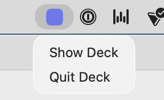
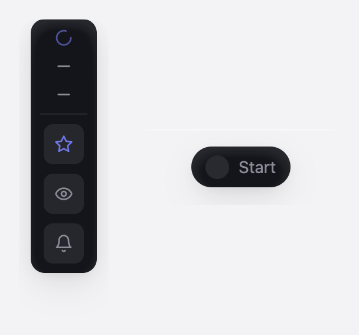

<div align="center">

# Deck

**A native desktop-app starter for macOS + Linux, built on [GPUI](https://www.gpui.rs/) + [gpui-component](https://github.com/longbridge/gpui-component).**

[](https://github.com/hellno/deck/actions/workflows/ci.yml)
[](LICENSE)

Fork it, rename it, ship it. You get a real title bar, the system menu bar, keyboard shortcuts,
a dark/light theme with a live accent picker, persisted settings, and an optional menu-bar (tray)
mode. Then delete the welcome screen and build your app — or wire in your own AI agent.


</div>

---

## Why this exists

[Zed](https://github.com/zed-industries/zed)'s **GPUI** is a fast, GPU-accelerated Rust UI
framework; [gpui-component](https://github.com/longbridge/gpui-component) adds a shadcn-style
component kit on top. Deck is the boilerplate you'd otherwise rewrite for every project — native
window, menu bar, shortcuts, a non-harsh theme, saved settings, an app icon, a shippable bundle —
done once and kept small: ~700 lines across a few files, fresh git-pinned GPUI
(reproducible via `Cargo.lock`), no submodules, no vendoring, no `node`.

## Quick start

Deck is a **template** — scaffold your own renamed app with [`cargo-generate`](https://github.com/cargo-generate/cargo-generate):

```
cargo install cargo-generate
cargo generate gh:hellno/deck --name my-app
```

It renames the crate, app name, bundle id, and config-dir consts for you (answer the bundle-org
prompt, or pass `-d bundle_org=acme`). Then:

```
cd my-app
cargo run
```

> Cloning this repo and running `cargo run` directly won't work — its source carries `{{ }}`
> template tokens (that's how the rename happens). Always scaffold via `cargo generate`.

The first build compiles GPUI + wgpu from source and takes roughly 5–15 minutes depending on the
machine (once); after that, rebuilds are fast. You need **`rustup`** — the exact Rust version is pinned
in `rust-toolchain.toml` (currently `1.95.0`, matching Zed) and installed automatically on first build.
[`just`](https://github.com/casey/just) is recommended for the task recipes (`cargo install just`, or
`brew install just` / your distro's package) — every recipe is plain `cargo` underneath, so it's
optional. Plus:

- **macOS 11+** — **Xcode Command Line Tools** (`xcode-select --install`). Apple Silicon + Intel.
  Renders with **Metal**.
- **Linux** — a GPU with **Vulkan** plus the dev libraries below. Renders with **Vulkan** (via
  `wgpu`); X11 and Wayland both work.

  ```bash
  sudo apt install build-essential pkg-config libxcb1-dev libxkbcommon-dev \
    libxkbcommon-x11-dev libwayland-dev libvulkan-dev libfontconfig1-dev \
    libfreetype6-dev libssl-dev          # + libgtk-3-dev libayatana-appindicator3-dev libxdo-dev for --features tray
  ```

> Same code on both. CI builds macOS **and** Linux on every push — see [Platforms](#platforms).

## What you get

|  | Feature | Where |
|---|---|---|
| 🪟 | Native window + custom transparent title bar (traffic lights on macOS, window controls on Linux) | `main.rs`, `shell.rs` |
| ⌘ | **Command palette** (⌘K) — fuzzy search, grouped, keyboard-first, recents | `command_palette.rs` |
| 🎨 | Dark/light theme + a live **accent picker** (6 colors) | `theme.rs` |
| ⚙️ | **Settings page** with preferences saved as JSON in the OS config dir | `settings.rs`, `settings_view.rs` |
| ⌨️ | **Keyboard shortcuts** → actions → menu items | `main.rs`, `shell.rs` |
| 📋 | Native **menu bar** (App / File / Edit / View) | `main.rs` |
| 🟣 | Optional **menu-bar / tray mode**, no dock icon — `--features tray` | `tray.rs` |
| 🫧 | Optional **floating overlay** — transparent always-on-top window (macOS; Linux no-op) — `--features overlay` | `overlay/` |
| 🔣 | **Lucide** icon set (ISC licensed, bundled) | `gpui-component` |
| 🖼️ | **App icon** pipeline (image → squircle → icns) + `cargo bundle` config | `scripts/`, `assets/`, `Cargo.toml` |

The how and why behind each is in **[docs/LEARNINGS.md](docs/LEARNINGS.md)**.

## Settings & theming


Open with **⌘,** or the gear in the title bar. Every control writes to a JSON file in the OS config
dir and applies live:

- **Theme** — dark / light, toggle anytime with **⌘⇧D** or the sun/moon button.
- **Accent** — six brand colors; picking one re-themes the whole app instantly (logo, buttons,
  focus rings, the tray icon).
- **Display name** — a text field that greets you on the home screen.

Preferences live at `~/Library/Application Support/<bundle-id>/settings.json`. The storage layer is
~40 lines of `serde` + the `directories` crate — see [LEARNINGS §3](docs/LEARNINGS.md#settings) for
how it compares to `confy` and Zed's settings system.

## Command palette (⌘K)


Press **⌘K** (Ctrl K) for a Superhuman/Linear-style launcher: a floating, top-anchored panel with
**fuzzy search**, commands **grouped by category**, a **Recent** group, **live shortcut chips**, and
full keyboard control (`↑↓` move, `↵` run, `esc` close). It's built on the same searchable-list
primitive (`List` + `ListDelegate`) that powers Zed's own palette, so the search box, navigation and
selection come for free — the whole feature is one heavily-commented file you own:
`src/command_palette.rs` (registry, fuzzy matcher, delegate, overlay, and its tests).

**Adding a command is one line.** Edit the `commands()` registry at the top of the file. If it maps
to an action you already have, just point at it — the palette dispatches the *same* action as the
hotkey and the menu bar, so the three can never drift, and the trailing shortcut chip is derived
**live from your keymap** (no hand-syncing labels):

```rust
Command {
    id: "home", title: "Go Home", icon: IconName::ArrowLeft,
    category: Category::Navigation, keywords: &["back", "welcome"],
    run: Run::Action(|| Box::new(GoBack)),
}
```

The fuzzy matcher is a compact, dependency-free subsequence scorer (rewards prefixes, word
boundaries and consecutive runs; highlights the matched characters) — small enough to read and
tweak. See [LEARNINGS §16](docs/LEARNINGS.md#command-palette) for the load-bearing details (why a
custom overlay over a dialog, how commands are run via the list's event, and the gotchas).

## Menu-bar / tray-first apps (`--features tray`)

```
cargo run --features tray
```



This turns Deck into a menu-bar app with no dock icon. The tray icon is a *native* status item — an
image plus a native menu, so there's **no second rendering system** and your windows stay GPUI — and
it recolors to match your accent. Menu clicks are bridged back into GPUI on its own executor.
`tray-icon` is cross-platform (`NSStatusItem` on macOS, `libappindicator` on Linux); the dock-hiding
is macOS-only and cfg-gated. Architecture in [LEARNINGS §8](docs/LEARNINGS.md#tray).

## Floating overlay (`--features overlay`)

```
cargo run --features overlay
```



This adds a transparent, always-on-top surface that floats over other apps — the seam for a HUD,
a quick-capture bar, or an ambient agent panel. It's a real GPUI window (no second renderer); the
panel is hardened via the shared `objc2` stack so it sits above full-screen spaces. macOS-only in
v1; on Linux it compiles to a no-op (no LayerShell yet), so a Linux build still passes. The module
lives in `src/overlay/` — see [docs/overlay.md](docs/overlay.md) for the design and the hardening
details.

## Platforms

| | macOS | Linux |
|---|---|---|
| Core app (window, theme, settings, menus, shortcuts) | ✅ verified, daily-driven | ✅ builds in CI¹ |
| Renderer | Metal | Vulkan (via `wgpu`), X11 + Wayland |
| App icon / bundle | `.app` + `.icns` (`just bundle`) | `cargo bundle --format deb`² |
| Tray (`--features tray`) | ✅ verified | ⚠️ builds (libappindicator); may need a GTK loop¹ |

¹ The author develops on macOS; Linux is kept honest by CI (`.github/workflows/ci.yml` builds both
on every push) but isn't daily-driven yet. Linux issues/PRs welcome.
² macOS-only `.icns` generation lives in `just icon`; the PNG it starts from is cross-platform.

## Make it yours (fork checklist)

1. **Rename the crate** — `name` in `Cargo.toml`.
2. **Change the display name** — `APP_NAME` in `src/main.rs` (drives the menu bar + window title).
3. **Change the bundle id** — `[package.metadata.bundle].identifier` in `Cargo.toml`, and the
   `QUALIFIER/ORGANIZATION/APPLICATION` consts in `src/settings.rs` (they pick the config-dir path).
4. **Swap the icon** — drop a 1024×1024 image at `assets/icon-source.png` and run `just icon` (bakes the macOS squircle tile + shadow and rebuilds `assets/icon.icns`), then `just bundle`. `just icon` needs **Python 3 + Pillow** (`pip install pillow`); the `.icns` step is **macOS-only** (it shells out to `iconutil`), while the PNG it starts from is cross-platform.
5. **Replace the UI** — gut `src/welcome.rs` (and add routes in `src/shell.rs`) and build your thing.

Then ship a real app:

```
cargo install cargo-bundle   # once
just bundle                  # → target/release/bundle/osx/<App>.app
```

## Wire in your agent

`Shell` is a normal GPUI view that owns state and reacts to actions — that's where your agent loop
lives:

- **Background work** — GPUI ships an async executor. From a view: `cx.spawn(async move |this, cx| { /* call your model / tools */ this.update(cx, |this, cx| cx.notify())?; })`.
- **Streaming** — push tokens into view state and call `cx.notify()` to re-render; GPUI diffs efficiently.
- **Tools / processes** — spawn subprocesses or HTTP from the executor; keep the UI thread free.
- **Persistence** — extend `Settings`, or drop in `rusqlite` for richer history.

Point it at the Anthropic API (Claude), a local model, or your own runtime — Deck doesn't care. The
`NewItem` handler in `shell.rs` is the seam: replace "create an item" with "start a run."

## Keyboard shortcuts

| Shortcut | Action |
|---|---|
| `⌘K` | Command palette |
| `⌘N` | New (fires the `NewItem` action) |
| `⌘,` | Open Settings |
| `⌘[` | Back |
| `⌘⇧D` | Toggle light / dark theme |
| `⌘Q` | Quit |

`⌘` on macOS, `Ctrl` on Linux/Windows. Add your own in two lines: declare it in the `actions!` macro
and add a `KeyBinding::new(...)`.

## Project layout

```
deck/
├── Cargo.toml            deps + [package.metadata.bundle] + the `tray` feature
├── justfile              run · bundle · icon · fmt · check
├── scripts/
│   └── make-app-icon.py  source image → squircle .icns (+ optional Linux/web)
├── assets/
│   ├── icon-source.png   your 1024² source art (drop it here)
│   ├── icon.png / .icns  generated app icons (`just icon`)
├── src/
│   ├── main.rs           bootstrap: window, menus, shortcuts, theme, settings
│   ├── shell.rs          root view: routing (Welcome/Settings) + app state
│   ├── command_palette.rs the ⌘K palette: command registry + fuzzy search + overlay
│   ├── welcome.rs        the home page (replace me)
│   ├── settings.rs       the persisted Settings struct (serde + config dir)
│   ├── settings_view.rs  the settings page UI
│   ├── theme.rs          refined palette + accent colors
│   ├── tray.rs           optional menu-bar tray icon (feature = "tray")
│   └── overlay/          optional transparent always-on-top surface (feature = "overlay")
└── docs/
    ├── LEARNINGS.md            deep dive: theme, icons, storage, menu bar, dock, tray
    ├── UPGRADING.md            how to bump gpui / gpui-component to the latest stable safely
    ├── overlay.md             the floating overlay surface: design + macOS hardening
    ├── background-jobs.md      running async work off the UI thread
    └── AGENTIC-ENGINEERING.md  why each lint + gate exists (the rules behind CLAUDE.md)
```

## Tech stack & the dependency story

```toml
# Default: fresh GPUI from git (Metal on macOS, wgpu on Linux). Pinned via Cargo.lock.
gpui                  = { git = "https://github.com/zed-industries/zed" }                            # Zed's UI framework (HEAD)
gpui_platform         = { git = "https://github.com/zed-industries/zed", features = ["font-kit"] }   # windowing + renderer (post crate-split)
gpui-component        = { git = "https://github.com/longbridge/gpui-component" }                     # shadcn-style kit, dev'd vs gpui HEAD
gpui-component-assets = { git = "https://github.com/longbridge/gpui-component" }                     # bundled Lucide SVGs + fonts
serde / serde_json            # settings serialization
directories                   # find the OS config dir (XDG on Linux, App Support on macOS)
# optional, behind `--features tray`:
tray-icon                     # native status item (cross-platform)
objc2 / objc2-app-kit         # macOS-only, dock hiding (target-gated to cfg(macos))
```

The GPUI pieces come **from git**, pinned to exact commits by the committed `Cargo.lock`. `gpui` is
Zed's *own* framework (repo `zed-industries/zed`); `gpui-component` (Longbridge) is the kit on top, and
it's developed against Zed's gpui **HEAD** — so the matched git pair is the only way to run *fresh* gpui
with the component kit. Why not crates.io? Zed publishes `gpui` there only rarely (the `0.2.x` line
shipped Oct 2025 and nothing since), so the published `gpui-component` is pinned to an ~8-month-old gpui
snapshot. Deck takes the fresh path and bumps on a cadence (`just bump-gpui`, ~monthly); the plain-stable
crates.io pair (`gpui = "0.2"` + `gpui-component = "0.5"`) is documented as a zero-git **fallback** —
which also sidesteps the GPL-3.0 binary obligation noted under [license](#credits--license), since the
crates.io `gpui` pulls none of Zed's git-only logging crates. Full
rationale + bump/fallback procedures in [LEARNINGS §2](docs/LEARNINGS.md#dependencies) and
[UPGRADING.md](docs/UPGRADING.md).

## Credits & license

Built on [Zed](https://github.com/zed-industries/zed) (GPUI) and
[Longbridge](https://github.com/longbridge/gpui-component) (gpui-component); icons are
[Lucide](https://lucide.dev) (ISC). Deck itself is 0BSD — zero-attribution, do whatever you want.
See [NOTICE](NOTICE) for third-party attributions.

**On the GPL crates — read this only if you ship a _closed-source_ binary.** Deck's default (git)
channel links three of Zed's crates that are `GPL-3.0-or-later` — `zlog`, `ztracing`, `ztracing_macro`
— via the chain `gpui → sum_tree → ztracing → zlog`. Deck didn't add them; Zed wired them into
`sum_tree` ([PR #44147](https://github.com/zed-industries/zed/pull/44147), Dec 2025), and at Deck's
default build they're inert no-ops (dormant Tracy instrumentation). GPL obligations attach only when
you **distribute a binary**, so what this means depends on you:

- **Build / run locally, or internal-only use** — nothing to do, on any channel.
- **Open-source fork** — nothing to do: if your source is public, GPL-3.0's source-availability
  requirement is met trivially (0BSD lets you fold your code into the combined work).
- **Closed-source / proprietary binary** — you can't statically link GPL-3.0 code and keep the
  result proprietary. Build on the permissive **crates.io pair** (`gpui = "0.2"`,
  `gpui-component = "0.5"`) instead: its `gpui_sum_tree` carries none of Zed's git tracing crates, so
  the binary is free of the GPL-3.0 chain. See [the dependency story](#tech-stack--the-dependency-story)
  and [UPGRADING.md](docs/UPGRADING.md).

Tracked upstream at [zed-industries/zed#55470](https://github.com/zed-industries/zed/issues/55470)
(likely to resolve at the source). This is a summary, not legal advice — details in [NOTICE](NOTICE).
