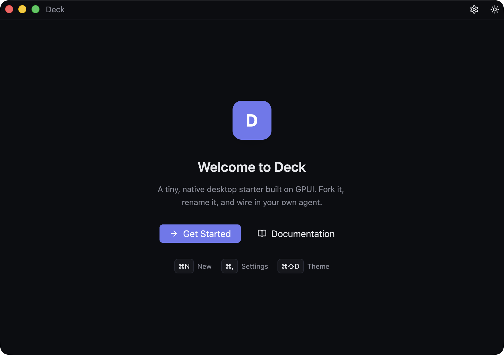
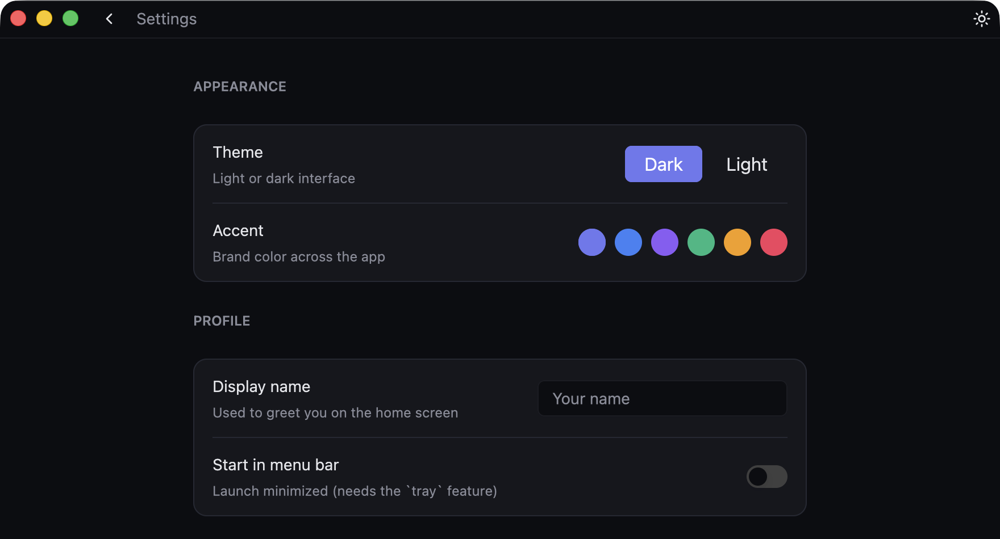
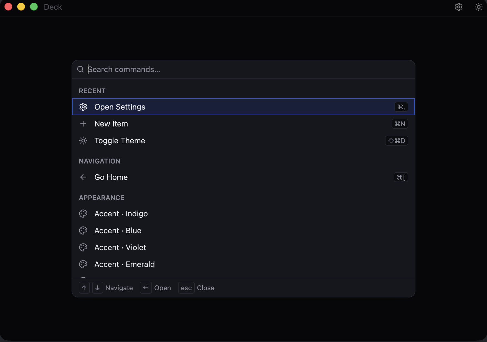

<div align="center">

# Deck

**A native desktop-app starter for macOS + Linux, built on [GPUI](https://www.gpui.rs/) + [gpui-component](https://github.com/longbridge/gpui-component).**

Fork it, rename it, ship it. You get a real title bar, the system menu bar, keyboard shortcuts,
a dark/light theme with a live accent picker, persisted settings, and an optional menu-bar (tray)
mode. Then delete the welcome screen and build your app — or wire in your own AI agent.



</div>

---

## Why this exists

[Zed](https://github.com/zed-industries/zed)'s **GPUI** is a fast, GPU-accelerated Rust UI
framework; [gpui-component](https://github.com/longbridge/gpui-component) adds a shadcn-style
component kit on top. Deck is the boilerplate you'd otherwise rewrite for every project — native
window, menu bar, shortcuts, a non-harsh theme, saved settings, an app icon, a shippable bundle —
done once, opinionated, and kept small: ~700 lines across a few files, pure crates.io deps, no
submodules, no vendoring, no `node`.

## Quick start

```
git clone <your-fork> my-app && cd my-app
cargo run
```

The first build compiles GPUI from source (a few minutes, once); after that, rebuilds are fast.
You need a stable **Rust** toolchain (`rustup`) and:

- **macOS 11+** — **Xcode Command Line Tools** (`xcode-select --install`). Apple Silicon + Intel.
  Renders with **Metal**.
- **Linux** — a GPU with **Vulkan** plus the dev libraries below. Renders with **Vulkan** (via
  `blade`); X11 and Wayland both work.

  ```bash
  sudo apt install build-essential pkg-config libxcb1-dev libxkbcommon-dev \
    libxkbcommon-x11-dev libwayland-dev libvulkan-dev libfontconfig1-dev \
    libfreetype6-dev libssl-dev          # + libgtk-3-dev libayatana-appindicator3-dev libxdo-dev for --features tray
  ```

> Same code on both. CI builds macOS **and** Linux on every push — see [Platforms](#platforms).

## What you get

|  | Feature | Where |
|---|---|---|
| 🪟 | Native window + custom transparent title bar (traffic lights on macOS, window controls on Linux) | `main.rs`, `shell.rs` |
| ⌘ | **Command palette** (⌘K) — fuzzy search, grouped, keyboard-first, recents | `command_palette.rs` |
| 🎨 | Dark/light theme + a live **accent picker** (6 colors) | `theme.rs` |
| ⚙️ | **Settings page** with preferences saved as JSON in the OS config dir | `settings.rs`, `settings_view.rs` |
| ⌨️ | **Keyboard shortcuts** → actions → menu items | `main.rs`, `shell.rs` |
| 📋 | Native **menu bar** (App / File / Edit / View) | `main.rs` |
| 🟣 | Optional **menu-bar / tray mode**, no dock icon — `--features tray` | `tray.rs` |
| 🔣 | **Lucide** icon set (ISC licensed, bundled) | `gpui-component` |
| 🖼️ | **App icon** pipeline (svg → png → icns) + `cargo bundle` config | `assets/`, `Cargo.toml` |

The how and why behind each is in **[docs/LEARNINGS.md](docs/LEARNINGS.md)**.

## Settings & theming



Open with **⌘,** or the gear in the title bar. Every control writes to a JSON file in the OS config
dir and applies live:

- **Theme** — dark / light, toggle anytime with **⌘⇧D** or the sun/moon button.
- **Accent** — six brand colors; picking one re-themes the whole app instantly (logo, buttons,
  focus rings, the tray icon).
- **Display name** — a text field that greets you on the home screen.

Preferences live at `~/Library/Application Support/<bundle-id>/settings.json`. The storage layer is
~40 lines of `serde` + the `directories` crate — see [LEARNINGS §3](docs/LEARNINGS.md#settings) for
how it compares to `confy` and Zed's settings system.

## Command palette (⌘K)



Press **⌘K** (Ctrl K) for a Superhuman/Linear-style launcher: a floating, top-anchored panel with
**fuzzy search**, commands **grouped by category**, a **Recent** group, **live shortcut chips**, and
full keyboard control (`↑↓` move, `↵` run, `esc` close). It's built on the same searchable-list
primitive (`List` + `ListDelegate`) that powers Zed's own palette, so the search box, navigation and
selection come for free — the whole feature is one heavily-commented file you own:
`src/command_palette.rs` (registry, fuzzy matcher, delegate, overlay, and its tests).

**Adding a command is one line.** Edit the `commands()` registry at the top of the file. If it maps
to an action you already have, just point at it — the palette dispatches the *same* action as the
hotkey and the menu bar, so the three can never drift, and the trailing shortcut chip is derived
**live from your keymap** (no hand-syncing labels):

```rust
Command {
    id: "home", title: "Go Home", icon: IconName::ArrowLeft,
    category: Category::Navigation, keywords: &["back", "welcome"],
    run: Run::Action(|| Box::new(GoBack)),
}
```

The fuzzy matcher is a compact, dependency-free subsequence scorer (rewards prefixes, word
boundaries and consecutive runs; highlights the matched characters) — small enough to read and
tweak. See [LEARNINGS §16](docs/LEARNINGS.md#command-palette) for the load-bearing details (why a
custom overlay over a dialog, how commands are run via the list's event, and the gotchas).

## Menu-bar / tray-first apps (`--features tray`)

```
cargo run --features tray
```

This turns Deck into a menu-bar app with no dock icon. The tray icon is a *native* status item — an
image plus a native menu, so there's **no second rendering system** and your windows stay GPUI — and
it recolors to match your accent. Menu clicks are bridged back into GPUI on its own executor.
`tray-icon` is cross-platform (`NSStatusItem` on macOS, `libappindicator` on Linux); the dock-hiding
is macOS-only and cfg-gated. Architecture in [LEARNINGS §8](docs/LEARNINGS.md#tray).

## Platforms

| | macOS | Linux |
|---|---|---|
| Core app (window, theme, settings, menus, shortcuts) | ✅ verified, daily-driven | ✅ builds in CI¹ |
| Renderer | Metal | Vulkan (via `blade`), X11 + Wayland |
| App icon / bundle | `.app` + `.icns` (`just bundle`) | `cargo bundle --format deb`² |
| Tray (`--features tray`) | ✅ verified | ⚠️ builds (libappindicator); may need a GTK loop¹ |

¹ The author develops on macOS; Linux is kept honest by CI (`.github/workflows/ci.yml` builds both
on every push) but isn't daily-driven yet. Linux issues/PRs welcome.
² macOS-only `.icns` generation lives in `just icon`; the PNG it starts from is cross-platform.

## Make it yours (fork checklist)

1. **Rename the crate** — `name` in `Cargo.toml`.
2. **Change the display name** — `APP_NAME` in `src/main.rs` (drives the menu bar + window title).
3. **Change the bundle id** — `[package.metadata.bundle].identifier` in `Cargo.toml`, and the
   `QUALIFIER/ORGANIZATION/APPLICATION` consts in `src/settings.rs` (they pick the config-dir path).
4. **Swap the icon** — drop a 1024×1024 PNG at `assets/icon.png` (or edit `assets/icon.svg` and run `just icon`).
5. **Replace the UI** — gut `src/welcome.rs` (and add routes in `src/shell.rs`) and build your thing.

Then ship a real app:

```
cargo install cargo-bundle   # once
just bundle                  # → target/release/bundle/osx/<App>.app
```

## Wire in your agent

`Shell` is a normal GPUI view that owns state and reacts to actions — that's where your agent loop
lives:

- **Background work** — GPUI ships an async executor. From a view: `cx.spawn(async move |this, cx| { /* call your model / tools */ this.update(cx, |this, cx| cx.notify())?; })`.
- **Streaming** — push tokens into view state and call `cx.notify()` to re-render; GPUI diffs efficiently.
- **Tools / processes** — spawn subprocesses or HTTP from the executor; keep the UI thread free.
- **Persistence** — extend `Settings`, or drop in `rusqlite` for richer history.

Point it at the Anthropic API (Claude), a local model, or your own runtime — Deck doesn't care. The
`NewItem` handler in `shell.rs` is the seam: replace "create an item" with "start a run."

## Keyboard shortcuts

| Shortcut | Action |
|---|---|
| `⌘K` | Command palette |
| `⌘N` | New (fires the `NewItem` action) |
| `⌘,` | Open Settings |
| `⌘[` | Back |
| `⌘⇧D` | Toggle light / dark theme |
| `⌘Q` | Quit |

`⌘` on macOS, `Ctrl` on Linux/Windows. Add your own in two lines: declare it in the `actions!` macro
and add a `KeyBinding::new(...)`.

## Project layout

```
deck/
├── Cargo.toml            deps + [package.metadata.bundle] + the `tray` feature
├── justfile              run · bundle · icon · fmt · check
├── assets/
│   ├── icon.svg / .png / .icns   source icon + generated app icons
├── src/
│   ├── main.rs           bootstrap: window, menus, shortcuts, theme, settings
│   ├── shell.rs          root view: routing (Welcome/Settings) + app state
│   ├── command_palette.rs the ⌘K palette: command registry + fuzzy search + overlay
│   ├── welcome.rs        the home page (replace me)
│   ├── settings.rs       the persisted Settings struct (serde + config dir)
│   ├── settings_view.rs  the settings page UI
│   ├── theme.rs          refined palette + accent colors
│   └── tray.rs           optional menu-bar tray icon (feature = "tray")
└── docs/
    └── LEARNINGS.md      deep dive: theme, icons, storage, menu bar, dock, tray
```

## Tech stack & the dependency story

```toml
gpui = "0.2"                  # longbridge/blade fork of Zed's GPUI (Metal on macOS, Vulkan on Linux)
gpui-component = "0.5"        # shadcn-style component kit built on top
gpui-component-assets = "0.5" # bundled Lucide icon SVGs + fonts
serde / serde_json            # settings serialization
directories                   # find the OS config dir (XDG on Linux, App Support on macOS)
# optional, behind `--features tray`:
tray-icon                     # native status item (cross-platform)
objc2 / objc2-app-kit         # macOS-only, dock hiding (target-gated to cfg(macos))
```

The GPUI pieces are **pure crates.io** — the matched, published pair, no git dependencies and no
vendoring. (Zed's own `gpui` is git-only; gpui-component publishes against the `gpui` 0.2 fork,
which is what makes a clean `cargo run` fork possible.) Full rationale in
[LEARNINGS §2](docs/LEARNINGS.md#dependencies).

## Credits & license

Built on [Zed](https://github.com/zed-industries/zed) (GPUI) and
[Longbridge](https://github.com/longbridge/gpui-component) (gpui-component); icons are
[Lucide](https://lucide.dev) (ISC). Deck itself is 0BSD — zero-attribution, do whatever you want.
See [NOTICE](NOTICE) for third-party attributions.
